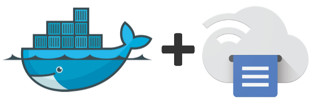

Google Cloudprint - Docker Image (Multiarch)
============================================

[](http://github.com/jaymoulin/docker-google-cloudprint/releases)
[](https://hub.docker.com/r/jaymoulin/google-cloudprint/)
[](https://hub.docker.com/r/jaymoulin/google-cloudprint/)
[](https://m.freewallet.org/id/374ad82e/btc)
[](https://m.freewallet.org/id/374ad82e/ltc)
[](https://utip.io/femtopixel)
[](https://www.paypal.me/jaymoulin)
[](https://www.buymeacoffee.com/3Yu8ajd7W)

This image allows you to configure your printer to your Google Cloudprint easily thanks to Docker.

Installation
---

```
docker run -d --privileged --restart=always -v /dev/bus/usb:/dev/bus/usb -v "$HOME/.cloudprint/":/root --name cloudprint -e CUPS_USER_ADMIN=admin -e CUPS_USER_PASSWORD=password -p 631:631 jaymoulin/google-cloudprint
```

You can change your admin login/password by replacing values for `CUPS_USER_ADMIN` and `CUPS_USER_PASSWORD`.

Change your `$HOME/.cloudprint/` volume to a path where you can keep your data. Then you'll be able to use the `configure load` and `configure save` to keep your configuration files 

Configuration
---
First, allow administration interface to be accessed to setup your printer:
```
docker exec cloudprint configure open
```
This will allow your printer to be configured. 
Go to http://__your_machine_ip__:631 to configure it

Login/Password couple defined with `$CUPS_USER_ADMIN` `$CUPS_USER_PASSWORD` in installation command

Once configured, close admin interface to secure it up and retrieve your Google Cloudprint URL.

```
docker exec -t cloudprint configure close
```

It will give you a Google Link. Copy/paste this URL in your browser to claim your printer, and voila!


Keeping data
------------

Use the following command to keep your CUPS configuration in your `save volume` (`$HOME/.cloudprint/` in the example)

```
docker exec -t cloudprint configure save
```

Use the following command to load your saved CUPS configuration from your `save volume` (`$HOME/.cloudprint/` in the example) back in CUPS 

```
docker exec -t cloudprint configure load
```


Updating
-----

When Google Cloudprint new version is released, you will be able to update your running version with this command:
 
```
docker exec -t cloudprint configure update
```

Appendixes
---

### Install Docker

If you don't have Docker installed yet, you can do it easily in one line using this command
 
```
curl -sSL "https://gist.githubusercontent.com/jaymoulin/e749a189511cd965f45919f2f99e45f3/raw/0e650b38fde684c4ac534b254099d6d5543375f1/ARM%2520(Raspberry%2520PI)%2520Docker%2520Install" | sudo sh && sudo usermod -aG docker $USER
```

### Build Docker Image

To build this image locally 
```
docker build -t jaymoulin/google-cloudprint .
```
